# Domain ERD

Este ERD deriva de `domain-specification-restructured.md`.

Notas de modelação:

- `Budget` e métricas como `Current Balance`, `Expected Balance`, `Available To Spend`, `Needs Used` e `Savings Progress` não aparecem como entidades porque são análise calculada.
- Entidades de configuração versionada aparecem separadas de `Household` e `Cycle` para preservar histórico.
- Tabelas de ligação representam relações many-to-many, listas versionadas e overrides específicos de ciclo.
- Campos polimórficos de auditoria são representados como `entityType` + `entityId`, não como uma FK única.

```mermaid
erDiagram
    USER {
        uuid id PK
        string displayName
        string email
        boolean passkeysEnabled
        datetime createdAt
    }

    SIGN_IN_METHOD {
        uuid id PK
        uuid userId FK
        string provider
        string providerSubject
        datetime createdAt
    }

    HOUSEHOLD {
        uuid id PK
        uuid creatorUserId FK
        uuid activeHouseholdConfigurationId FK
        uuid primarySavingsGoalId FK
        string name
        string currency
        datetime createdAt
    }

    MEMBER {
        uuid id PK
        uuid householdId FK
        uuid userId FK
        boolean isAdmin
        string status
        datetime joinedAt
    }

    ACCOUNT {
        uuid id PK
        string name
        string accountType
        uuid primaryAccountId FK
        string currency
        string status
        datetime createdAt
    }

    ACCOUNT_OWNER {
        uuid accountId FK
        uuid userId FK
        string ownershipRole
        datetime addedAt
    }

    HOUSEHOLD_CONFIGURATION {
        uuid id PK
        uuid householdId FK
        uuid defaultBudgetRuleId FK
        uuid primarySavingsGoalId FK
        string name
        int version
        string lifecycleState
        int cycleStartDayOfMonth
        int eatingOutTimesPerWeek
        string eatingOutPreferredDays
        decimal eatingOutMaxAmountPerPerson
        datetime effectiveFrom
        datetime createdAt
    }

    HOUSEHOLD_CONFIGURATION_MEMBER {
        uuid householdConfigurationId FK
        uuid memberId FK
        datetime includedFrom
    }

    HOUSEHOLD_CONFIGURATION_ACCOUNT {
        uuid householdConfigurationId FK
        uuid accountId FK
        datetime includedFrom
    }

    HOUSEHOLD_CONFIGURATION_BUDGET_RULE {
        uuid householdConfigurationId FK
        uuid budgetRuleId FK
        string ruleRole
    }

    CYCLE {
        uuid id PK
        uuid householdId FK
        uuid householdConfigurationId FK
        uuid budgetConfigurationId FK
        datetime startsAt
        datetime endsAt
        string state
        datetime createdAt
    }

    BUDGET_CONFIGURATION {
        uuid id PK
        uuid cycleId FK
        uuid savingsGoalOverrideId FK
        decimal savingsTargetOverrideAmount
        boolean savingsTargetOverrideAcceptedBelowRecommended
        datetime createdAt
    }

    BUDGET_CONFIGURATION_EXCLUDED_ACCOUNT {
        uuid budgetConfigurationId FK
        uuid accountId FK
        string reason
    }

    BUDGET_CONFIGURATION_EXCLUDED_INCOME {
        uuid budgetConfigurationId FK
        uuid transactionId FK
        string reason
    }

    BUDGET_CONFIGURATION_IGNORED_RECURRING {
        uuid budgetConfigurationId FK
        uuid recurringTransactionDefinitionId FK
        string reason
    }

    EATING_OUT_WEEKLY_OVERRIDE {
        uuid id PK
        uuid budgetConfigurationId FK
        date weekStartDate
        int timesPerWeek
        string preferredDays
        decimal maxAmountPerPerson
        string status
    }

    RECURRING_INSTANCE_OVERRIDE {
        uuid id PK
        uuid budgetConfigurationId FK
        uuid recurringTransactionDefinitionId FK
        uuid completedTransactionId FK
        date plannedDate
        date overrideDate
        decimal overrideAmount
        string instanceState
    }

    FINANCIAL_GOAL {
        uuid id PK
        uuid householdId FK
        string name
        decimal targetAmount
        date deadline
        int priority
        string state
        boolean isPrimarySavingsGoal
        datetime createdAt
    }

    BUDGET_RULE {
        uuid id PK
        decimal needsPercentage
        decimal wantsPercentage
        decimal savingsPercentage
        string name
        datetime createdAt
    }

    ACCOUNT_RULE {
        uuid id PK
        uuid accountId FK
        string name
        string state
        datetime createdAt
    }

    ACCOUNT_RULE_ALLOWED_CATEGORY {
        uuid accountRuleId FK
        uuid categoryId FK
    }

    CATEGORY {
        uuid id PK
        uuid parentCategoryId FK
        string name
        string transactionType
        string defaultBudgetGroup
        string icon
        boolean requiresRecurringDefinition
        datetime createdAt
    }

    MERCHANT {
        uuid id PK
        uuid defaultCategoryId FK
        string name
        string defaultEmoji
        string logoUrl
        string websiteUrl
        datetime createdAt
    }

    MERCHANT_ALLOWED_CATEGORY {
        uuid merchantId FK
        uuid categoryId FK
    }

    TRANSACTION_IMPORT {
        uuid id PK
        uuid createdByUserId FK
        string originType
        string artifactUrl
        string workflowState
        datetime createdAt
    }

    TRANSACTION {
        uuid id PK
        uuid userId FK
        uuid accountId FK
        uuid budgetRuleId FK
        uuid categoryId FK
        uuid merchantId FK
        uuid transactionImportId FK
        uuid purchaseMadeByUserId FK
        decimal amount
        string currency
        datetime transactionTimestamp
        string state
        string transactionType
        string budgetGroupOverride
        string description
        datetime createdAt
    }

    TRANSACTION_ITEM {
        uuid id PK
        uuid transactionId FK
        uuid categoryId FK
        decimal amount
        string budgetGroupOverride
        string description
    }

    RECURRING_TRANSACTION_DEFINITION {
        uuid id PK
        uuid userId FK
        uuid accountId FK
        uuid categoryId FK
        uuid budgetRuleId FK
        decimal amount
        string currency
        string description
        string frequency
        int dayOfMonth
        date startDate
        date endDate
        string state
        datetime createdAt
    }

    AUDIT_LOG {
        uuid id PK
        string entityType
        uuid entityId
        string action
        uuid performedByUserId FK
        datetime performedAt
        string previousValueJson
        string newValueJson
    }

    USER ||--o{ SIGN_IN_METHOD : has
    USER ||--o{ MEMBER : appears_as
    HOUSEHOLD ||--o{ MEMBER : contains
    USER ||--o{ HOUSEHOLD : creates

    USER ||--o{ ACCOUNT_OWNER : owns
    ACCOUNT ||--|{ ACCOUNT_OWNER : has_owner
    ACCOUNT ||--o| ACCOUNT : savings_account_for

    HOUSEHOLD ||--o{ HOUSEHOLD_CONFIGURATION : versions
    HOUSEHOLD_CONFIGURATION ||--o{ HOUSEHOLD_CONFIGURATION_MEMBER : includes
    MEMBER ||--o{ HOUSEHOLD_CONFIGURATION_MEMBER : versioned_in
    HOUSEHOLD_CONFIGURATION ||--o{ HOUSEHOLD_CONFIGURATION_ACCOUNT : includes
    ACCOUNT ||--o{ HOUSEHOLD_CONFIGURATION_ACCOUNT : aggregated_by
    HOUSEHOLD_CONFIGURATION ||--o{ HOUSEHOLD_CONFIGURATION_BUDGET_RULE : defines
    BUDGET_RULE ||--o{ HOUSEHOLD_CONFIGURATION_BUDGET_RULE : configured_in
    BUDGET_RULE ||--o{ HOUSEHOLD_CONFIGURATION : default_for

    HOUSEHOLD ||--o{ FINANCIAL_GOAL : has
    FINANCIAL_GOAL ||--o{ HOUSEHOLD : primary_savings_goal
    FINANCIAL_GOAL ||--o{ HOUSEHOLD_CONFIGURATION : primary_savings_goal

    HOUSEHOLD ||--o{ CYCLE : has
    HOUSEHOLD_CONFIGURATION ||--o{ CYCLE : snapshot_for
    CYCLE ||--|| BUDGET_CONFIGURATION : has
    BUDGET_CONFIGURATION ||--o{ BUDGET_CONFIGURATION_EXCLUDED_ACCOUNT : excludes
    ACCOUNT ||--o{ BUDGET_CONFIGURATION_EXCLUDED_ACCOUNT : excluded_from_cycle
    BUDGET_CONFIGURATION ||--o{ BUDGET_CONFIGURATION_EXCLUDED_INCOME : excludes
    TRANSACTION ||--o{ BUDGET_CONFIGURATION_EXCLUDED_INCOME : income_excluded_from_cycle
    BUDGET_CONFIGURATION ||--o{ BUDGET_CONFIGURATION_IGNORED_RECURRING : ignores
    RECURRING_TRANSACTION_DEFINITION ||--o{ BUDGET_CONFIGURATION_IGNORED_RECURRING : ignored_in_cycle
    BUDGET_CONFIGURATION ||--o{ EATING_OUT_WEEKLY_OVERRIDE : has
    BUDGET_CONFIGURATION ||--o{ RECURRING_INSTANCE_OVERRIDE : has
    RECURRING_TRANSACTION_DEFINITION ||--o{ RECURRING_INSTANCE_OVERRIDE : overridden_in_cycle
    TRANSACTION ||--o{ RECURRING_INSTANCE_OVERRIDE : completes
    FINANCIAL_GOAL ||--o{ BUDGET_CONFIGURATION : savings_override

    ACCOUNT ||--o{ ACCOUNT_RULE : has
    ACCOUNT_RULE ||--o{ ACCOUNT_RULE_ALLOWED_CATEGORY : allows
    CATEGORY ||--o{ ACCOUNT_RULE_ALLOWED_CATEGORY : allowed_by

    CATEGORY ||--o{ CATEGORY : parent_of
    CATEGORY ||--o{ MERCHANT : default_for
    MERCHANT ||--o{ MERCHANT_ALLOWED_CATEGORY : allows
    CATEGORY ||--o{ MERCHANT_ALLOWED_CATEGORY : allowed_for

    USER ||--o{ TRANSACTION_IMPORT : creates
    TRANSACTION_IMPORT ||--o{ TRANSACTION : generates
    USER ||--o{ TRANSACTION : receives_income
    USER ||--o{ TRANSACTION : made_purchase
    ACCOUNT ||--o{ TRANSACTION : owns_expense
    BUDGET_RULE ||--o{ TRANSACTION : allocates_income
    CATEGORY ||--o{ TRANSACTION : categorizes
    MERCHANT ||--o{ TRANSACTION : appears_on
    TRANSACTION ||--o{ TRANSACTION_ITEM : contains
    CATEGORY ||--o{ TRANSACTION_ITEM : categorizes

    USER ||--o{ RECURRING_TRANSACTION_DEFINITION : receives_recurring_income
    ACCOUNT ||--o{ RECURRING_TRANSACTION_DEFINITION : pays_recurring_expense
    CATEGORY ||--o{ RECURRING_TRANSACTION_DEFINITION : categorizes
    BUDGET_RULE ||--o{ RECURRING_TRANSACTION_DEFINITION : allocates_recurring_income

    USER ||--o{ AUDIT_LOG : performs
```

